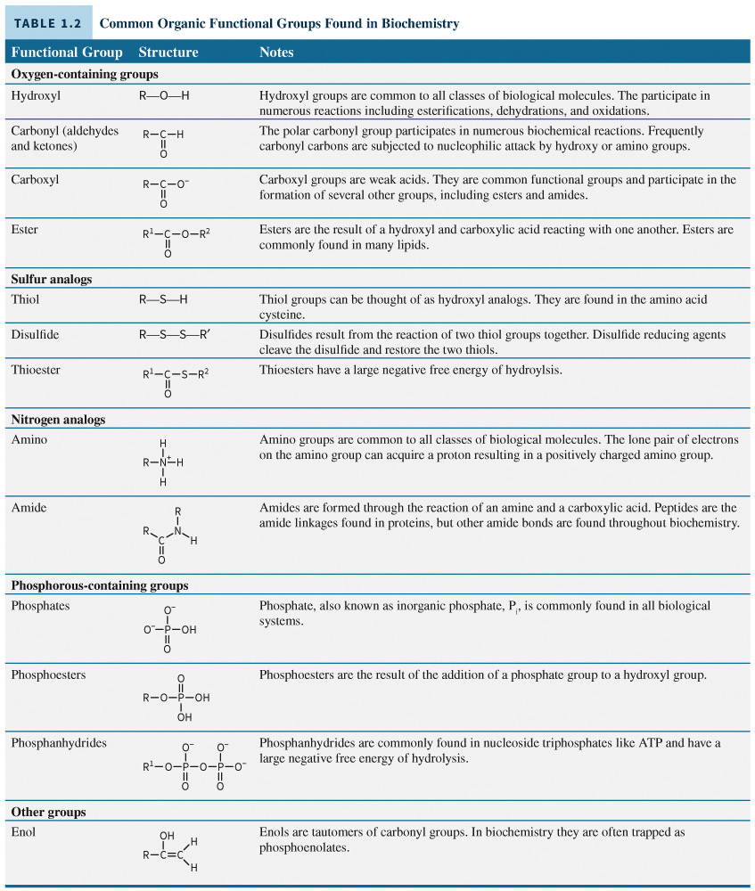
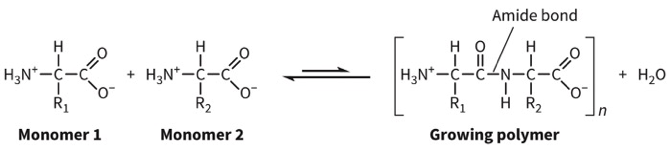
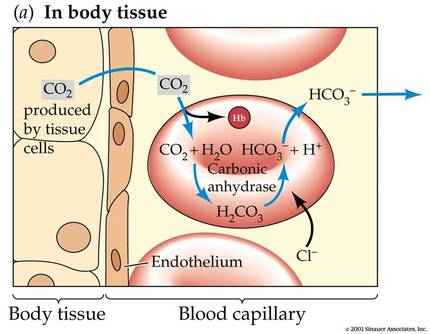

## Chapter 01 Outline
1.1 General chemical principles
1.2 Fundamental concepts of organic chemistry
1.3 The chemistry of water
## Learning Objectives
1. Apply the basic principles of thermodynamics, equilibrium, and kinetics to biological systems.
2. Describe biological molecules and processes using the tools of organic chemistry.
3. Perform basic calculations pertaining to the chemistry of water and aqueous systems.
## Section 1.1 Learning Objective
Apply the basic principles of thermodynamics, equilibrium, and kinetics to biological systems.
## Thermodynamics Defined
Thermodynamics is the study of energy.It can provide information about how and why a reaction can occur. It can also provide information about the conditions required for a reaction to occur.
## First Law of Thermodynamics
Energy is conserved. It cannot be created or destroyed but only converted from one form to another.
Forms of energy
- Kinetic
- Potential
- Heat
- Chemical
## Second Law of Thermodynamics
The entropy of the universe (S) is always increasing. The entropy of a system increases in disorder and randomness.
## Third Law of Thermodynamics
The entropy of a perfect crystalline system at 0 K is 0.
## Gibbs Free Energy
ΔG = ΔH − TΔS
H = enthalpy
T = temperature (in K)
S = entropy
ΔG does not predict reaction rate
Negative = favorable (spontaneous)
Positive = nonfavorable (nonspontaneous)
## Reaction Spontaneity
|ΔH|ΔS|ΔG|Comments|
|---|---|---|---|
|−|+|−|Always spontaneous|
|+|+|+ or -|Spontaneous at high temperatures|
|−|−|+ or -|Spontaneous at low temperatures|
|+|−|+|Never spontaneous|
## Standard Free Energy State, ΔG°
Free energy at standard state conditions:
- T = 298K
- P = 1 atm
- [solutes] = 1 M
- pH = 7.0This can affect overall free energyFor the reaction:
- a A + b B → c C + d D
- ΔG = ΔG° + RT ln $\frac {[C]c[D]d} {[A]a[B]b}$

Under standard chemical conditions used to calculate ΔG°, what is the pH for a reaction involving protons?

## ATP Hydrolysis
Figure 1.2 Hydrolysis of ATP.

## ATP Hydrolysis
ATP hydrolysis has a large negative ΔG. This reaction can be used to drive reactions forward.
## Coupling Reactions
A process in which unfavorable reactions can be made energetically possible by linking them to favorable ones
Figure 1.4 Coupling favorable and unfavorable reactions.

## Equilibrium Defined
Equilibrium is the chemical state when the rate of the forward and reverse state of a reaction are equal. Concentrations of reactants and products do not need to be the same. Le Châtelier’s principle states that all reactions seek to move toward equilibrium.
## Equilibrium Can Relate to Free Energy
For the reaction, a A + b B → c C + d D
$K_{eq}$ = equilibrium constant
$K_{eq}$ = $\frac {[C]c[D]d} {[A]a[B]b}$
ΔG = ΔG° + RT $\frac {[C]c[D]d} {[A]a[B]b}$
Since ΔG at equilibrium = 0, ΔG° = −RT ln $K_{eq}$
$K_{eq}$ = $e^{\frac {−ΔG°} {RT}}$​
## Kinetics Defined
Kinetics is the field of study that analyzes the rates of chemical reactions. It can involve single or multiple reactants to make single or multiple products. It depends on [products] and [reactants], temperature, and factors specific to that individual reaction.
## Graphical Interpretation of Kinetics
Figure 1.5A Reaction coordinates and catalysis.

## Rate Law Defined
Rate law is the rate of any chemical reaction that can be described using a mathematical expression.
- A + B → C
- Rate = d[C]/dt = k [[A] [B]
## Catalyst Defined
Catalyst is a biological enzyme that speeds up a reaction by lowering the activation energy.  It helps a system reach equilibrium more quickly. It does not affect ΔG, the equilibrium [reactants] or [products]. 
## Section 1.2 Learning Objective
Describe biological molecules and processes using the tools of organic chemistry. 
## Functional Groups Defined
Functional groups are fragments of a molecule, such as a hydroxyl or carbonyl group. 

## Solubility and Polarity
Biochemistry occurs in aqueous systems.Water is a common solvent in the body. Molecules can be made more water soluble by adding more polar groups.and groups are polar (can form hydrogen bonds). Hydrophobic (nonpolar) molecules are less soluble in water.
## Reaction Mechanism Defined
Reaction mechanism explains the making and breaking of bonds at the molecular level. Reaction arrows indicate the direction of the reaction (electron flow).
## Reaction Mechanisms
Figure 1.7 Reaction mechanisms.

## Polymers Defined
Polymers are macromolecular assemblies of smaller building blocks (monomers). They can be connected in a linear or branched fashion. Examples include: DNA, RNA, proteins, enzymes, glycogen, starch, and cellulose.

## Section 1.3 Learning Objective
Perform basic calculations pertaining to the chemistry of water and aqueous systems.
## Water, a Polar Molecule
Figure 1.8 Structure of water. Water molecules form a complex but rapidly changing network of hydrogen bonds in the liquid phase. Hydrogen bonds are constantly broken and reformed as the molecules rotate and move. However, each molecule forms an average of 3.4 hydrogen bonds at any given time.

The **hydrogen-bond donor** is the group that includes both the electronegative atom to which the hydrogen atom is covalently bonded and the hydrogen atom itself. The electronegative atom to which the hydrogen atom is covalently bonded pulls electron density away from the hydrogen atom. Thus, the hydrogen atom develops a partial positive charge (δ+). This partial positive charge can interact with a lone pair of electrons on an atom having a partial negative charge (δ−).
The **hydrogen-bond acceptor** is the lone pair of electrons that is on the opposing electronegative atom with a partial negative charge (δ−).
## Hydrogen Bonding at Work
Figure 1.10 Hydrogen bonding. A hydrogen bond is a dipole–dipole interaction in which a hydrogen atom is partially shared by two electronegative atoms (such as nitrogen or oxygen).

## Water’s Polarity Influences the Strength of Ionic Interactions
The polarity of a solvent has to be categorized by the dielectric constant. The high dielectric constant means that it can readily solubilize many ionic solids and significantly decrease ionic interactions.
## Dielectric Constant
Figure 1.9 Coulombic interactions. Sodium chloride dissolves because the ions form favorable interactions with water molecules. As the sodium ions disperse, their positive charges form noncovalent interactions with the partially negative charges of the oxygen atoms of water. Similarly, the chloride ions are surrounded by the partially positive charges on the hydrogen atoms.

## Acids and Bases
Arrhenius
- Acids: donors
- Bases: generate
Brønsted-Lowry
- Acids: donors
- Bases: acceptors
## pKa, a Measure of Acid Strength
$K_a$, the acid ionization constant
Measures the acidity of a proton
$K_a$ = $\frac {[H^+] [A^−]}{[HA]}$
Strong acids have high $K_a$ values because they fully dissociate in water
$pK_a$ = $−log K_a$
where H+ is the proton concentration; $A^–$ is the conjugate base of the acid, and \[HA\] is the concentration of the acid at equilibrium (in M).
The higher the $pK_a$, the less acidic the proton. 

## pH, a Measure of Acidity
pH measures acidity.
This is an important factor in all biochemical reactions.
pH = $−log [H^+]$
pH scale is in the range 0–14.
## Buffers Defined
**Buffers** are solutions of an acid–base conjugate pair that resist changes in pH upon the addition of acid or base.
The pH of the buffered solution does not change nearly as rapidly as that of pure water.
In general, a weak acid is most effective in buffering against pH changes in the vicinity of its pKa value.
Biomolecules are sensitive to pH. So, biological systems and biochemists use buffers to maintain proper pH.

## Henderson–Hasselbalch Equation
An expression used to calculate the pH of a buffer system
pH = $pK_a$ + $log \frac {[A−]}{[HA]}$
$pK_a$ = $pK_a$ of the weak acid, $[A^–]$ is the molar concentration of the conjugate base of the weak acid and \[HA\] is the concentration of the un-ionized weak acid, also expressed in units of molarity, M.
## Buffering Capacity Defined
Buffering capacity is the pH at which a weak acid or conjugate base system will buffer. This is a function of its $pK_a$​, but the total amount of acid or base that can be consumed is a function of the concentration.

The bicarbonate buffer system is the main regulator of blood pH, maintaining it within a narrow range through the reversible reaction $CO_2$ + $H_2O$ ↔ $H_2CO_3$ ↔ $H^+$ + $HCO_3^-$. Because this equilibrium is linked to both respiration and kidney function, changes in ventilation or acid production can shift blood pH toward acidosis or alkalosis. For example, intense exercise can increase acid load, hyperventilation can lower $CO_2$ and raise pH, and hypoventilation can cause $CO_2$ retention and lower pH. In this way, the buffer system provides a biochemical basis for how the body responds to common physiological disturbances.
## Vignettes
#### Vignette 1
Following a bout of intense exercise, the pH of the exerciser’s blood was found to be 7.1. If the $HCO_3^−$​ concentration is 8 mM and the $pK_a$ for $HCO_3^−$​ is 6.1, what is the concentration of $CO_2$​ in the blood? The normal concentration of $CO_2$​​ in the blood is approximately 25 mM.

> Please note: “One cannot diagnose acid–base disturbances from an isolated total CO2 measurement. In order to characterize an acid–base disturbance, one needs pH, pCO2, total CO2, as well as a measurement of the anion gap. Given that caveat, one can use the following guidelines. Low levels of total CO2 result from either metabolic acidosis or as a compensation to respiratory alkalosis. Bicarbonate levels below 10 mEq/L virtually identify metabolic acidosis as the cause, as compensation for respiratory alkalosis will not drive the bicarbonate that low.” https://www.ncbi.nlm.nih.gov/books/NBK308/

#### Vignette 2
A 19-year-old college athlete takes a large dose of salicylic acid tablets for musculoskeletal pain. Salicylic acid is a weak acid with a pKa of 3.0, and its un-ionized (HA) form is more lipid-soluble and crosses biological membranes more readily than the ionized form A⁻. After ingestion, the drug is exposed to gastric fluid (pH ≈ 1.0) and then absorbed into the bloodstream (pH ≈ 7.4).
At gastric pH 1.0, approximately what percentage of salicylic acid in the stomach is present in the more lipid-soluble form?
1. About 1%
2. About 9%
3. About 50%
4. About 99%

Based on your calculation in Question 1 and the difference between gastric pH and plasma pH, which statement best describes salicylic acid’s absorption and distribution?
1. It is more un-ionized in plasma, so it is absorbed poorly from the stomach and remains trapped in blood.
2. It is mostly un-ionized in the stomach, favoring absorption there; once in plasma it becomes more ionized and tends to remain in the bloodstream.
3. It is mostly ionized in the stomach, so absorption from the stomach is minimal; in plasma it becomes un-ionized and rapidly leaves the circulation.
4. It is equally un-ionized in stomach and plasma, so pH has negligible effect on its absorption and distribution.